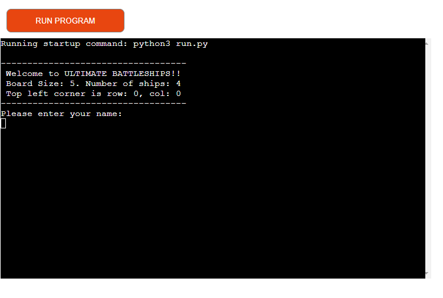
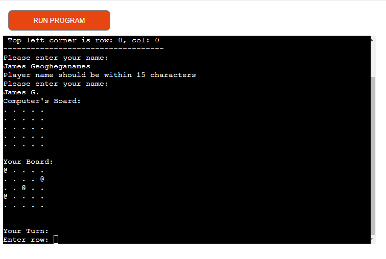
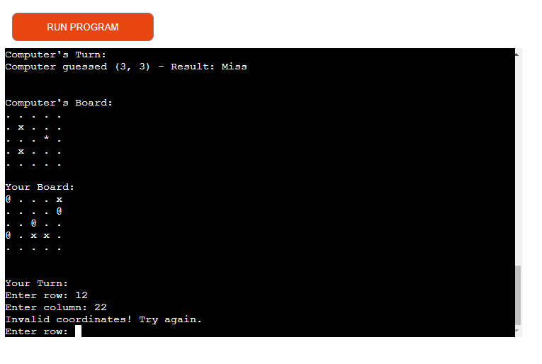
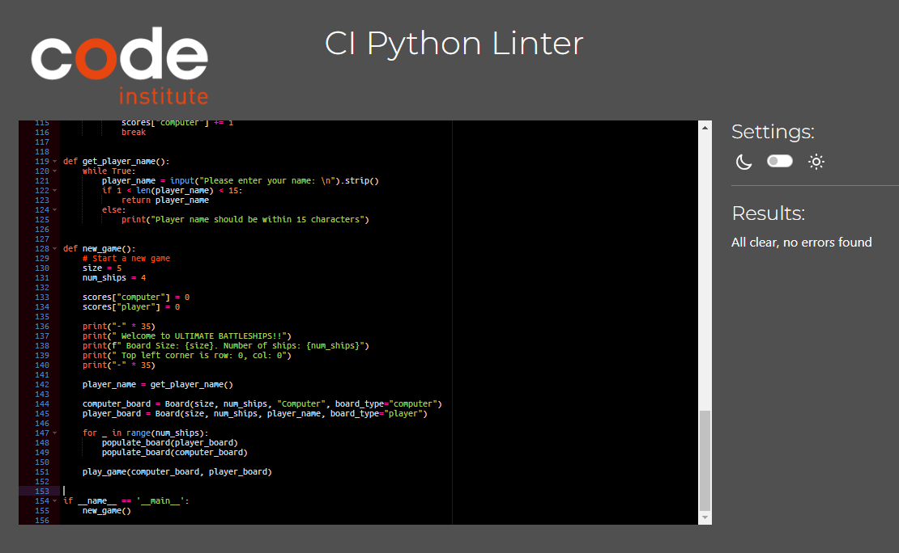

# Ultimate Battleships-Prela

Ultimate Battleships-Prela is a Python terminal game that users can play on Heroku. The objective is to beat the computer by locating and sinking all of the computer's battleships before it sinks yours. Each battleship occupies one square on the board.

- **Live Link**: [Play Ultimate Battleships-Prela](https://battleship-prela-805a22d0542f.herokuapp.com/)

## How to Play

Ultimate Battleships-Prela is based on the classic pen-and-paper game Battleship. You can learn more about the original game on [Wikipedia](https://en.wikipedia.org/wiki/Battleship_(game)). In this version, players enter their names and two boards are randomly generated. The player can see their own ships (indicated by @) but not the computer's ships. Guesses are marked on the board with X for misses and * for hits. Players and the computer take turns guessing locations, with the goal being to sink all of the opponent's battleships first.

## User Stories

### User Story 1: Player Registration
- **As a player**, I want to enter my name at the start of the game to personalize my gaming experience.

### User Story 2: Player's Board Visibility
- **As a player**, I want to see the locations of my battleships (indicated by @) so that I know where they are placed.

### User Story 3: Hidden Computer's Board
- **As a player**, I want the computer's battleships to be hidden to maintain a level of challenge and surprise.

### User Story 4: Guessing Mechanism
- **As a player**, I want to make guesses about the locations of the computer’s battleships to try and sink them.

### User Story 5: Hit and Miss Indicators
- **As a player**, I want to see an X for a miss and a * for a hit on the board to track my progress.

### User Story 6: Winning Condition
- **As a player**, I want to win by sinking all of the computer's battleships.

### User Story 7: Computer's Turn Logic
- **As a player**, I want the computer to make intelligent guesses to find my battleships, making the game challenging.

### User Story 8: Game Instructions
- **As a new player**, I want clear instructions on how to play the game.

### User Story 9: Game Feedback
- **As a player**, I want immediate feedback after each guess (hit, miss, or invalid).

### User Story 10: Game Restart
- **As a player**, I want the option to restart the game after it ends.

## Flowchart

## Features

### Existing Features
- **Random Board Generation**: Ships are randomly placed on both the player's and computer's boards.

  

- **Play Against the Computer**: Players compete against a computer opponent.
- **User Input**: Accepts player input for names and guesses.

  

- **Input Validation and Error-Checking**: Ensures inputs are within the grid, are numbers, and not repeated guesses.

  

  
  
  

- **Class Instances for Data Management**: The game uses class instances to manage data such as board states and player information.

### Future Features
- **Customizable Board Size and Ship Number**: Allow players to choose board size and number of ships.
- **Manual Ship Placement**: Allow players to position their ships.
- **Larger Ships**: Introduce ships larger than 1x1.

## Data Model

The game uses a `Board` class model. Two instances of the `Board` class are created to hold the player's and the computer's boards. The `Board` class stores board size, number of ships, ship positions, guesses, board type, and player names. Methods include printing the board, adding ships, and processing guesses.

## Technology Used
- **Python**
- **GitHub**
- **Gitpod**
- **Heroku**

## Testing

### Manual Testing
- **PEP8 Compliance**: Code passed through PEP8 linter with no issues.
- **Invalid Inputs**: Tested with strings, out-of-bounds inputs, and repeated guesses.
- **Local and Heroku Testing**: Ensured functionality in both environments.

### Test Cases

#### Test Case 1: Invalid Row and Column Input
- **Test Name**: Test Invalid Row Input
- **Description**: Verify handling of invalid row input.
- **Steps**: Start the game, enter a valid name, and input invalid coordinates.

  

#### Test Case 2: Valid Row and Column Input
- **Test Name**: Test Valid Row and Column Input
- **Description**: Verify processing of valid row and column input.
- **Steps**: Start the game, enter a valid name, and input valid coordinates.

  

## Bugs

### Solved Bugs
- **False Positives in Validation**: Resolved an issue with the `validate_coordinates` function's if statement structure.

### Remaining Bugs
- **None**: All known bugs have been resolved.

### Validator Testing
- **PEP8**: No errors returned from the [PEP8 CI](https://pep8ci.herokuapp.com/#).

  

## Deployment

The project was deployed using Heroku.

### Steps for Deployment
1. Fork or clone the repository.
2. Create a new Heroku app.
3. Set buildpacks to Python and NodeJS in that order.
4. Link the Heroku app to the repository.
5. Click Deploy.

### Forking the Repository
1. Log into GitHub and locate the repository: [https://github.com/ROCK3879/Battleship.git](https://github.com/ROCK3879/Battleship.git)
2. Click the 'Fork' button at the top of the repository to create a copy.

### Accreditation
Special thanks to the [PEP8 CI tool](https://pep8ci.herokuapp.com/#) for validating the code.

Additional thanks to:
- The [Battleship Wikipedia page](https://en.wikipedia.org/wiki/Battleship_(game)) for game rules and inspiration.
- The Python community and documentation for guidance and support.
- [GitHub](https://github.com/) for hosting the project repository.
- [Heroku](https://www.heroku.com/) for providing a platform to deploy the game.

---

Happy coding! 
